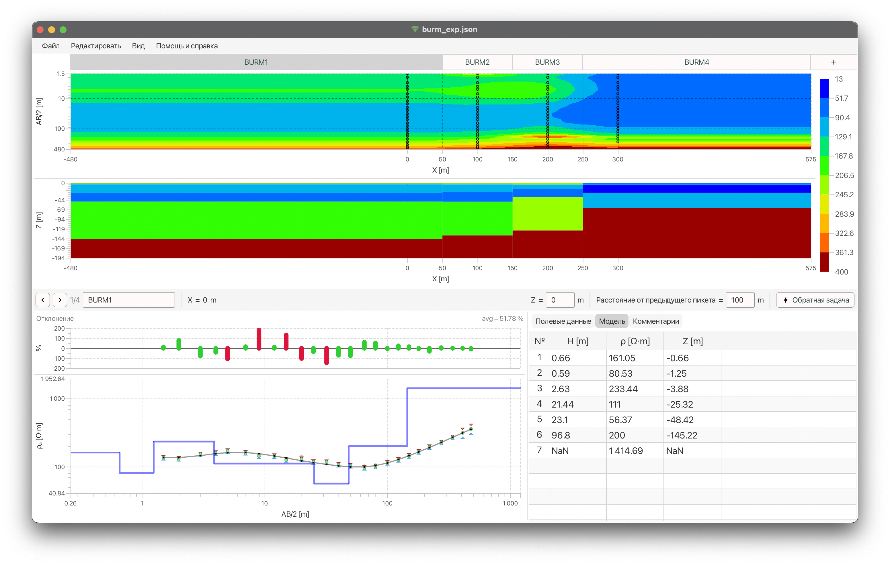

# GEM

> **G**eophysics **E**lectro**M**etry



Программное обеспечение, созданное для обучения студентов методам электроразведки.

## Руководство пользователя

Руководство пользователя GEM версии 1 доступно по [ссылке](docs/Руководство%20пользователя%20GEM.pdf)

## Сборка исходников и запуск

Программу можно запустить из исходного кода, используя систему сборки Gradle.

Для этого необходимо:

1) Клонировать репозиторий
    ```shell
    git clone https://github.com/NucodeLabs/GEM.git
    cd GEM
    ```
2) Запустить, используя Gradle Wrapper
    ```
    ./gradlew run
    ```

Программа соберется и запустится.
Папка выполнения программы в таком случае будет `.run` в корне проекта.
В нее будут скопированы необходимые во время исполнения библиотеки и файлы, а также в ней будет лог ошибки (в формате
`*.log`).
По завершении исполнения папка автоматически очистится системой Gradle.

## Сборка дистрибутива

### Windows
```shell
gradle packageWindowsExe
```

### macOS
```shell
gradle packageMacApp
```
